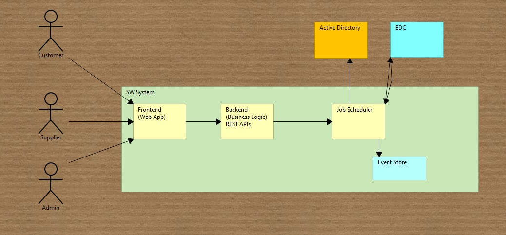
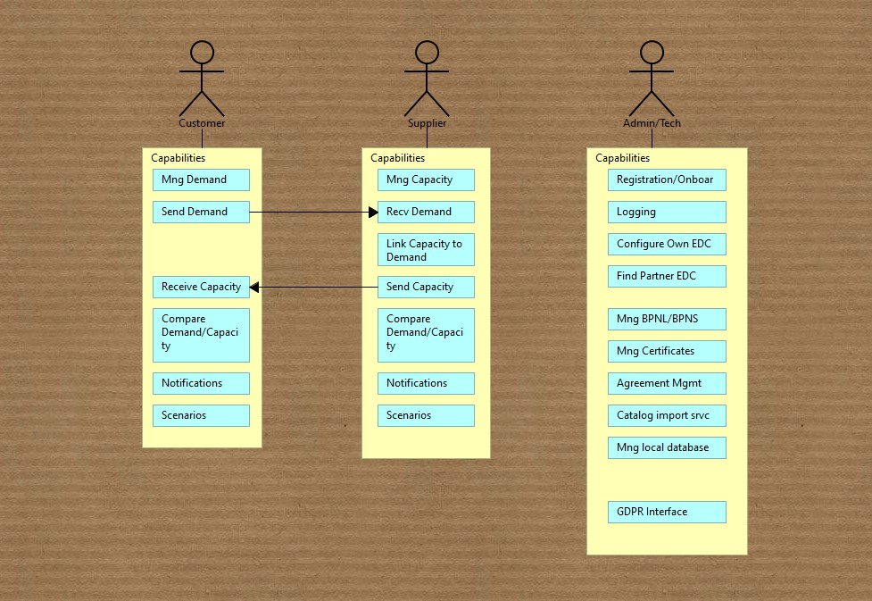

# Demand and Capacity Management

Turbulence in the global economy, technological change, and limited availability of resources are impacting industries. Catena-X enables a secure exchange of demand and capacity data of all partners involved in the automotive network: from raw material to n-tier suppliers to car manufacturers.

# Resilient supply chains

Demand and capacity management (BKM) is based on a collaborative process. Those who are part of the Catena-X network can securely share their demand and capacity data with other collaborators: with suppliers just as much as with automotive manufacturers and recyclers.

The Catena-X ecosystem offers protected spaces with a common view of the data released. This enables the partners to react at an early stage to changes in plans and deviations and to jointly find a solution based on the situation.

Establishing a collaborative process significantly increases transparency and creates a more robust and resilient supply chain.

# Advantages for everyone involved

Improved planning reliability and accuracy;

Increased transparency about the demand and capacity situation as well as their fluctuations;

Early detection of problems and the ability to avoid capacity bottlenecks;

Less under/overproduction through better utilization;

Reduced costs by avoiding expensive re-planning and improved material procurement;

Increased delivery reliability and customer satisfaction.

# This project

This repository serves to attach any documentation about demand-capacity-mgmt, for now you can check the folder images to see the following:

App Flow Diagram

Components Architecture Diagram

Deployment Architecture Diagram

Personas and Capabilities Diagram

