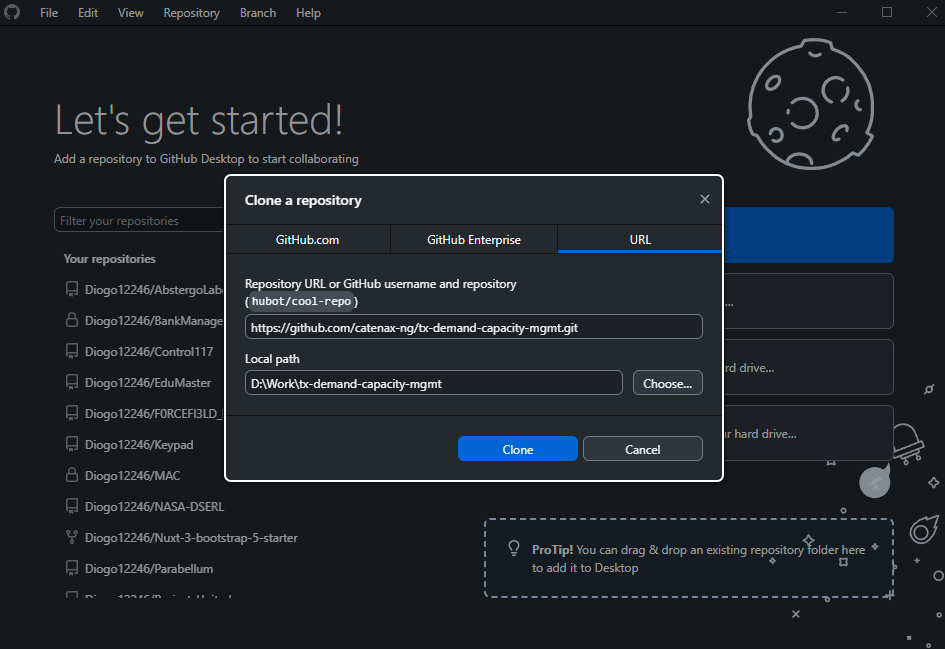
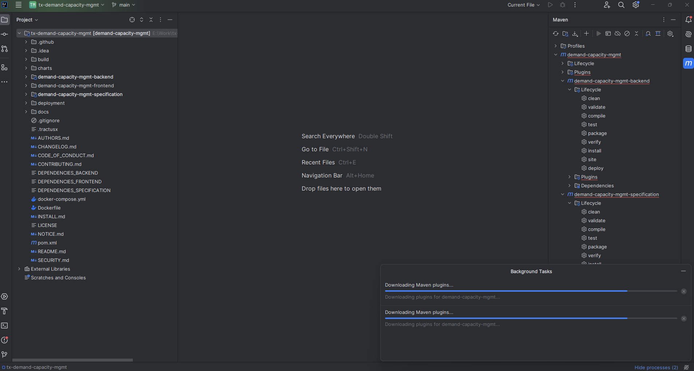
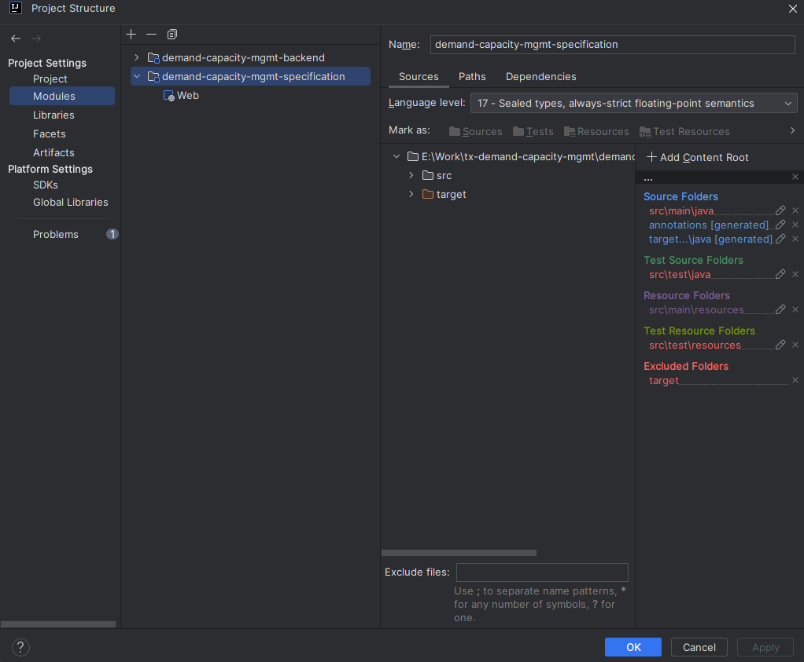
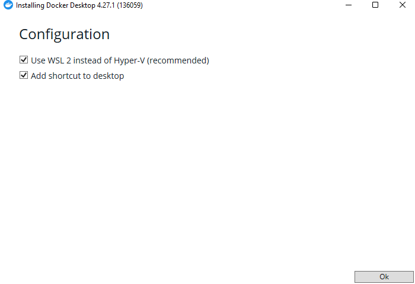
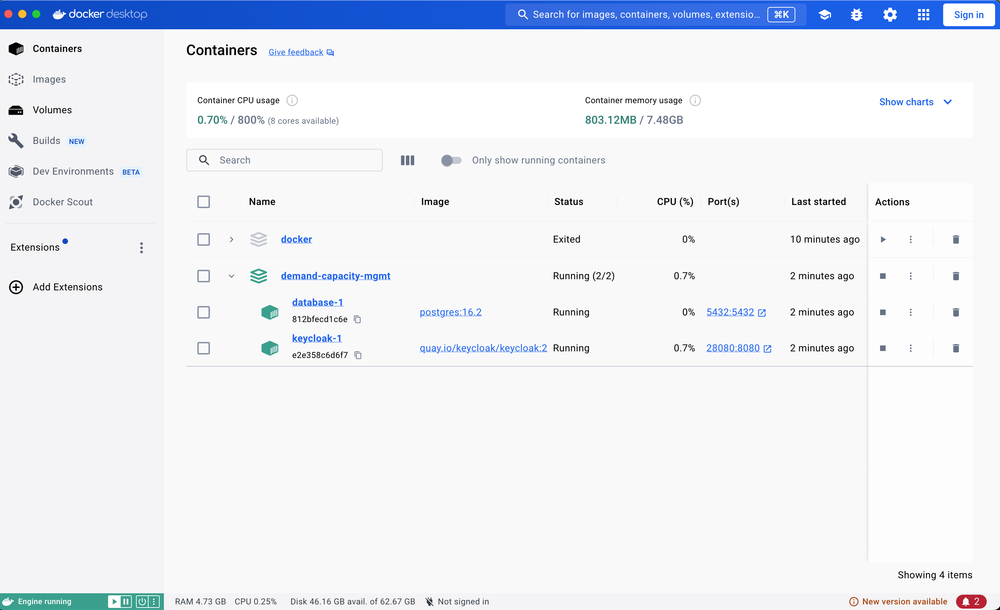
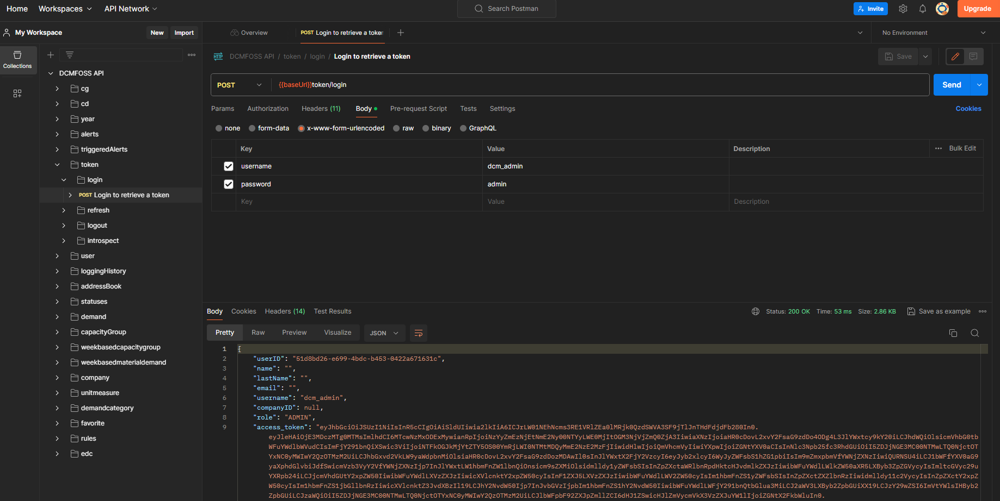
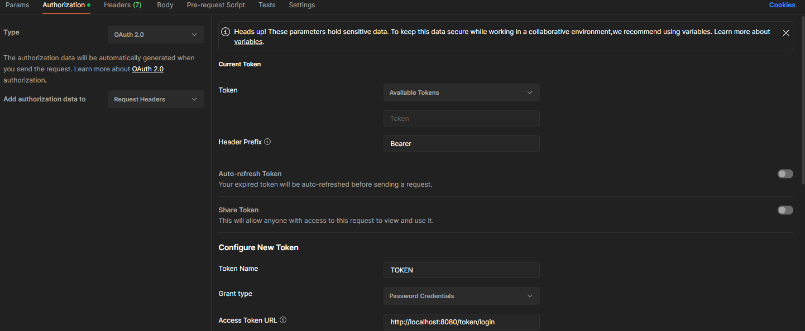
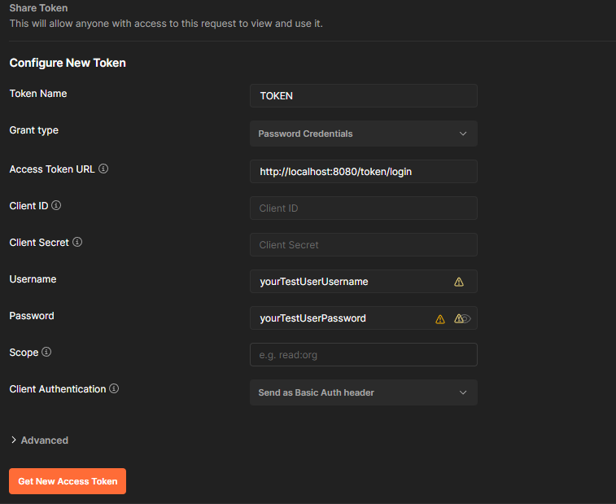
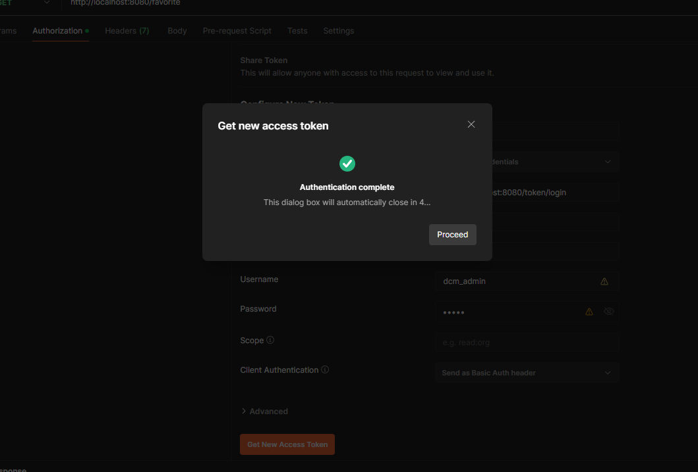
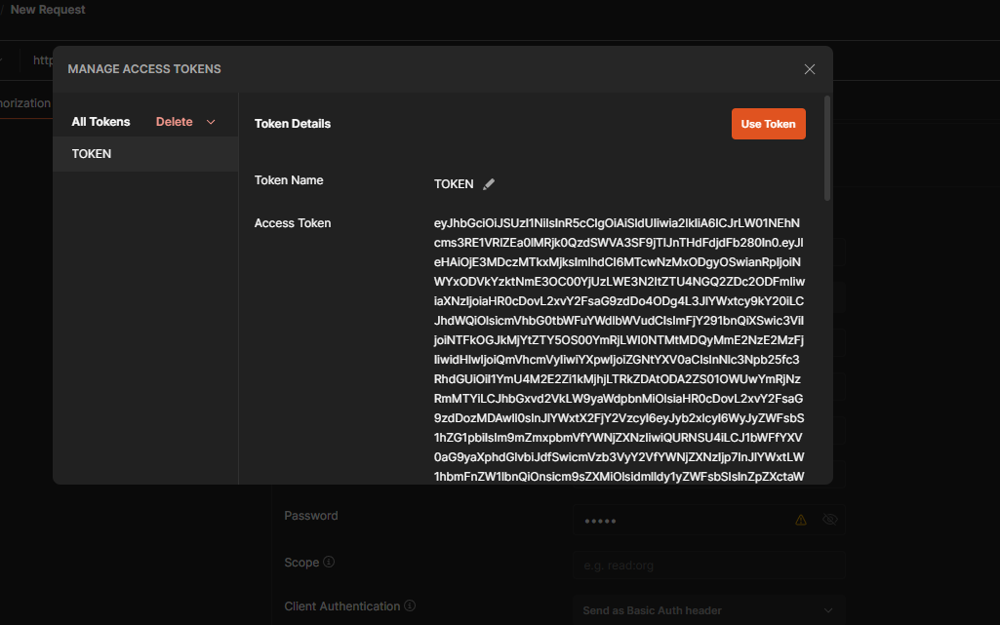

Table of Contents

1. [DCMFOSS Local Development Deployment](#dcmfoss-local-development-deployment)
   - [Prerequisites](#prerequisites)
   - [Guide](#guide)
      - [Cloning the repository](#cloning-the-repository)
      - [Open in your own IDE of choice](#open-in-your-own-ide-of-choice)
      - [Docker desktop](#docker-desktop)
      - [Running containers](#running-containers)
      - [Running project first time for init configs](#running-project-first-time-for-init-configs)
      - [Running Keycloak](#running-keycloak)
      - [Fetching the keycloak client credential](#fetching-the-keycloak-client-credential)
      - [Configure postman collection requests](#configure-postman-collection-requests)
      - [Run the front-end](#run-the-front-end)
   - [Postmand Collection](#Postman-collection)
   - [Notice](#notice)

# DCMFOSS Local Development Deployment

## Prerequisites

This guide assumes the following prerequisites are true.
It was built considering an updated windows build with docker running, but will try to provide general instructions.

  - Basic coding knowledge
  - Basic Docker/Kubernetes knowledge
  - JDK 17 ( or Higher)
  - Maven 'Spring Boot is compatible with Apache Maven 3.5 or above'
  - Git/Github Desktop
  - NodeJS installed
  - Yarn installed
  - Docker Desktop

## Guide:
Let's begin local development install!

- ### Cloning the repository
    Clone the repository from the url below

      git clone https://github.com/eclipse-tractusx/demand-capacity-mgmt.git
  
    

- ### Open in your own IDE of choice
    Boot your IDE of choice and open the backend repo,
    add the specification as a module of the backend project.
    
    

    

  it is normal for startup to have errors, let your IDE finish configuring and download dependencies.

  go ahead and run a maven clean and install on the specification cycle.
  if it fails saying you don't have a JDK, choose JDK17 of your choice.

- ### Docker desktop

  Please refer to the official docker desktop installation guide: https://docs.docker.com/desktop/  
  Please refer to the official WSL Documentation: https://learn.microsoft.com/en-us/windows/wsl/

  

  
Click me to expand quickstart guide

      Before you run the project we need to setup Postgres and Keycloak.
    Let's begin with installing docker(if you are running windows make sure to use WSL2).
    After installing docker on your machine lets install postgres.
    if you get an error of Hyper V make sure **virtualization is enabled on your motherboard
    and if you're on windows, enable Hyper-V feature-**
    if you get an error of wsl update not supported
    download and install 

    https://wslstorestorage.blob.core.windows.net/wslblob/wsl_update_x64.msi 
    
    open a powershell and type 

      wsl --set-default-version 2
    
    then try again

    
  

- ### Running containers

  This project includes integrated support for Spring Boot Docker Compose, facilitating the setup of Keycloak and PostgreSQL without manual intervention.

  You won't need to manually start containers or configure settings. The application will reference the `compose.yaml` file located at the root of the project.

  Feel free to adjust configurations (such as ports and credentials) in the `compose.yaml` file to suit your requirements.

  When the application starts, it automatically creates a PostgreSQL container with the provided environment credentials. Additionally, a new database for Keycloak is set up.

  On startup, the application also creates a Keycloak container based on the configurations in the Compose file. Initial configurations, including the creation of realms, clients, and users, are performed using the `dcm_realm.json` file.

  

  Further you can login with keycloak admin credentials configured in `compose.yaml` and modify users to you heart's content(under the users tabs, credentials for them, assing roles, etc)

  Ref: https://spring.io/blog/2023/06/21/docker-compose-support-in-spring-boot-3-1

  **Remember you need to have a user role on all users, it can be ADMIN, CUSTOMER, SUPPLIER**
  failing to have one of these roles won't let the user login in the app.

  [Download keycloak realm json](realm-export.json)

- ### Fetching the keycloak client credential
  before booting the project again navigate to dcmauth client on keycloak panel and copy the client secret under credentials.
  open your application.yaml and place it on the dcmsecr section.
  
  after that run the project and in postman you should be able to login on the token endpoint with the credentials you modified on keycloak!

  

- ### Configure postman collection requests!
  for the other requests on postman you need to alter the authorization tab.
  check the config on the images provided.

  the access token url should be either the backend or in last resort if it fails, this one 
  **http://localhost:8888/auth/realms/dcm/protocol/openid-connect/token** 
  if an authorization error occurs, it most likely is the url error of keycloak, newer versions of keycloak you need to remove **/auth/** from the authorization url.

  

  

  

  

 

- ### Run the front-end
  when postman is working, you need to open the front end on your IDE of choice and run on a terminal inside the front-end folder, make sure you have NodeJS installed on your machine.

      npm install --force --legacy-peer-deps

      npm start

  the app will be booted on localhost:3000

  for a user to correctly login you need to add a company to the DB and add that company to the user
  Admin needs to have a company, even if a dummy one.
  otherwise you will get lowerCase error on frontend when trying to read company Ids

## Postman Collection

[Download Postman collection](DCMFOSS_postman.json)

## NOTICE

This work is licensed under the [Apache-2.0](https://www.apache.org/licenses/LICENSE-2.0).

- SPDX-License-Identifier: Apache-2.0
- SPDX-FileCopyrightText: 2022,2024 Bayerische Motoren Werke Aktiengesellschaft (BMW AG)
- SPDX-FileCopyrightText: 2022,2024 Contributors to the Eclipse Foundation
- Source URL: https://github.com/eclipse-tractusx/demand-capacity-mgmt/
