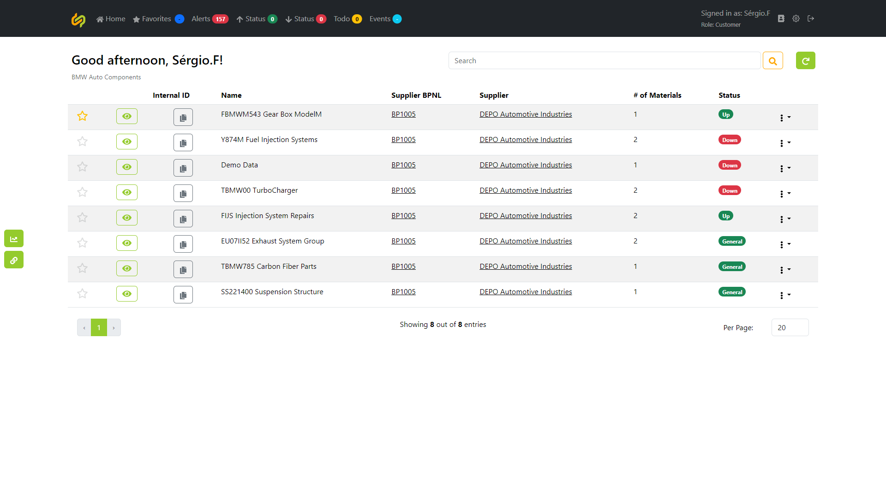
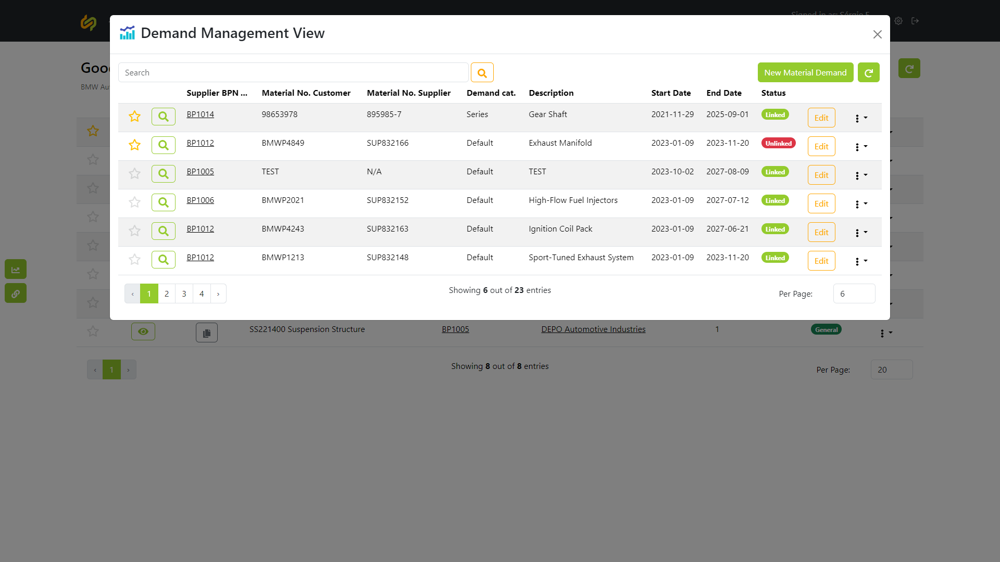
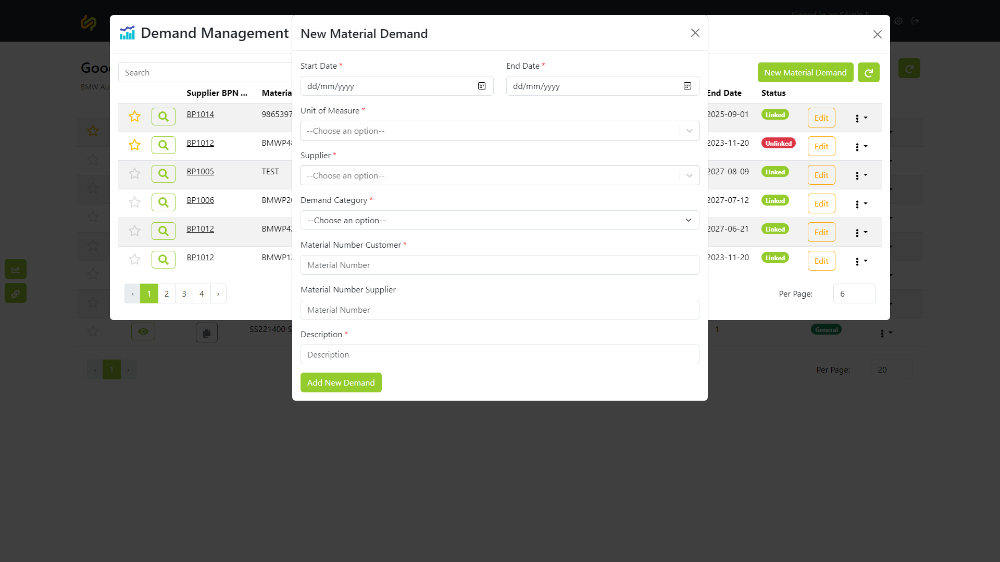
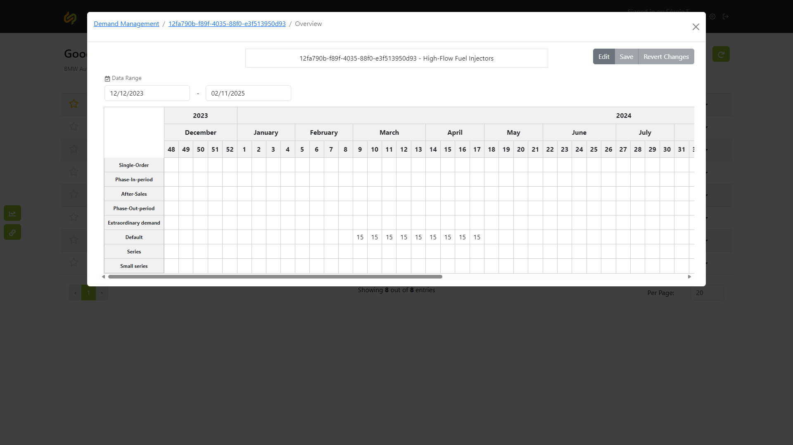
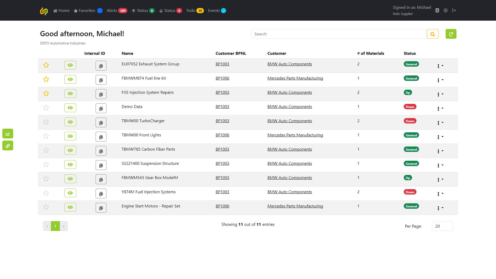
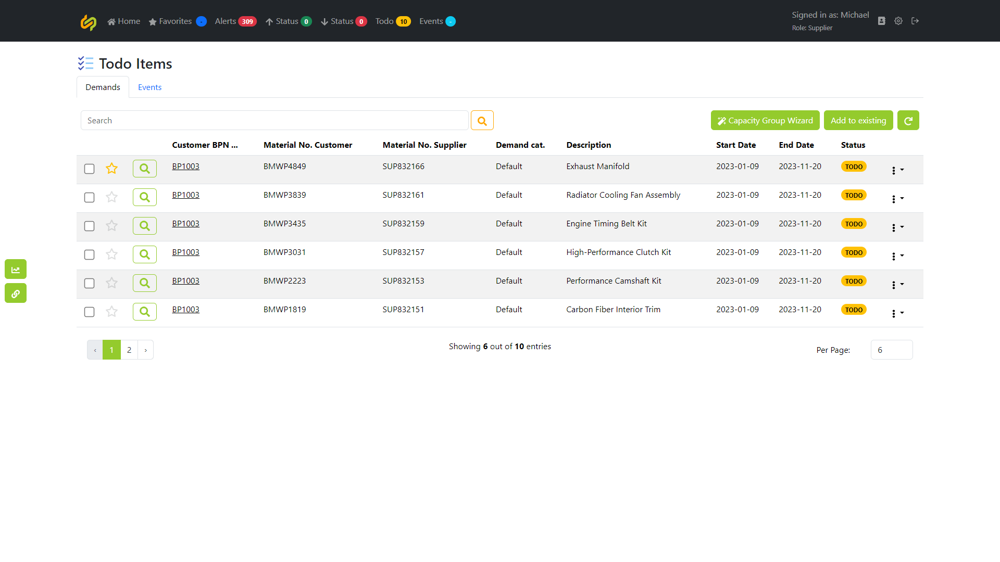
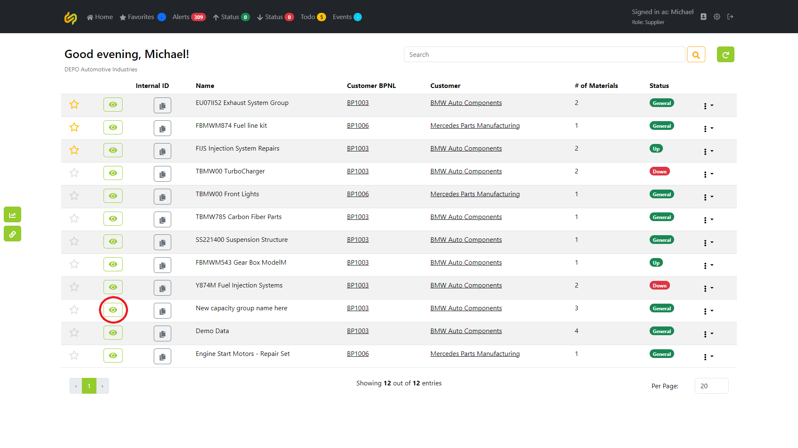
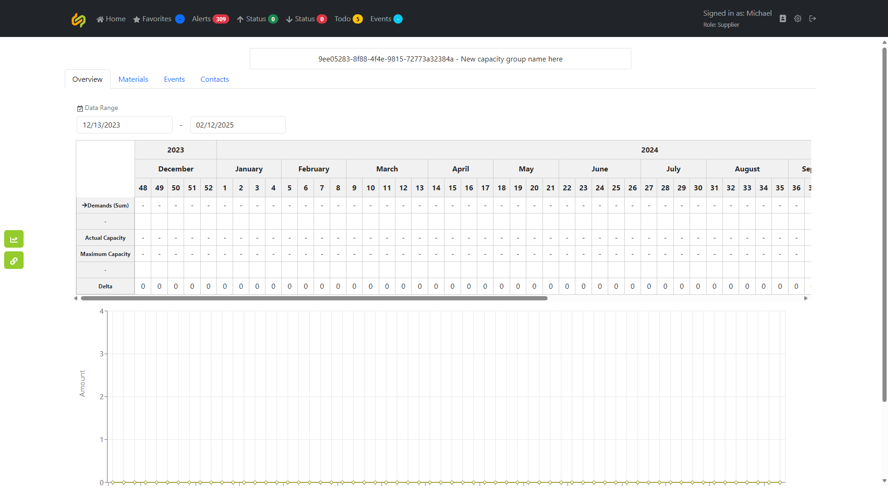
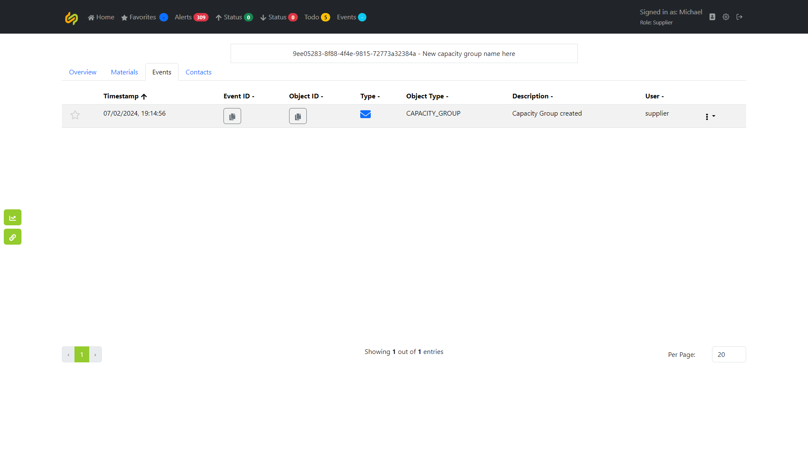
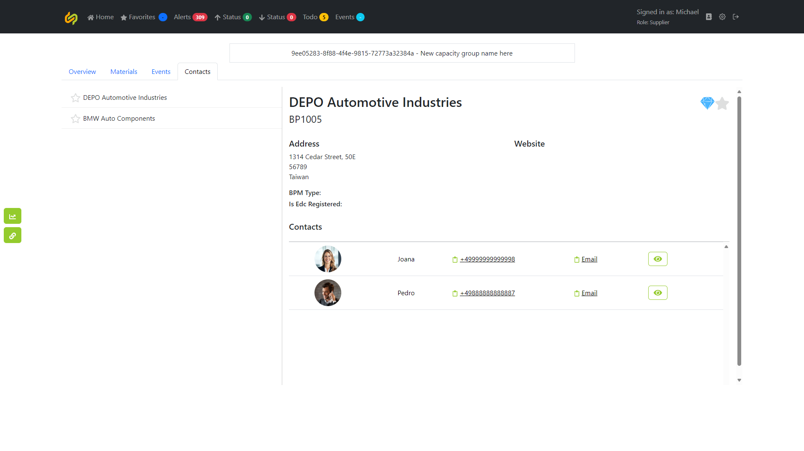

Table of contents:
- [Customer](#customer)
- [Supplier](#supplier)
- [Admin](#admin)

# User Flow

## Customer

- **Create Demand:** 
    1. Access the application dashboard.

    2. Navigate to the "Demand Management" section.

    3. Click on the "Create New Demand" button.
    4. Fill in the required details such as unit of measure, supplier, category, start and end date, etc.

    6. Submit the demand for processing.
- **Update Values:** 
    1. Access the application dashboard.
    
    2. Go to the "Demand Management" section.
    
    3. Locate the previously created demand.
    4. Click on  to view its details.
        
    5. Make necessary updates to the demand values on its various categories, by clicking on Edit.
    6. Verify the accuracy of the updated values.
    7. Save the changes.

## Supplier

- **Manage Capacity Groups:** 
    1. Access the application dashboard as a supplier.
    
    2. On the top menu select the **Todo** section, it will show you the count of the demands waiting a supplier interaction .
    3. View pending demands, the supplier can then select them and assign them to a capacity group or create a new one if necessary.
    
        **3a.** If the supplier decides to create a new capacity group, he will need to click on Capacity Group Wizard he will then be presented with a step by step process to create a new capacity group.
        
        **3b.** To add to an existing capacity group, simply click on **Add to existing** and follow the prompt.
        
    4. Now, accessing the newly created capacity group on the dashboard by clicking on the  icon.
    
    5. We can monitor and assign maximum and actual capacity in production lines to the capacity group, in its various categories.
    

        **5a.** They can visualize the associated material demands on the **Materials** tab.
        

        **5b.** The events registered on the Capacity group by acessing the **Events** tab.
        

        **5c.** The contacts of the associated companies on the **Contacts** tab.
        

## Admin

**Admin Panel:**
1. Access the dashboard as an admin user.
2. Navigate to the "Admin Panel", by clicking the  icon.

**Configuering Thresholds:**
1. Access the dashboard as an admin user.
2. Navigate to the "Admin Panel", by clicking the  icon.
3. Inside the **Admin Panel** you need to look at the left menu and click on **Threshold Config** 

4. Once inside the thresholds config panel, you can add, delete, enable or disable thresholds to your liking. 
5. You can also enable them for specific companies or capacity groups, or, disable them!.

## NOTICE

This work is licensed under the [Apache-2.0](https://www.apache.org/licenses/LICENSE-2.0).

- SPDX-License-Identifier: Apache-2.0
- Licence Path: https://creativecommons.org/licenses/by/4.0/legalcode
- Copyright (c) 2022,2023 Contributors to the Eclipse Foundation
- Copyright (c) 2022, 2023 Bayerische Motoren Werke Aktiengesellschaft (BMW AG)
- Source URL: https://github.com/eclipse-tractusx/tx-demand-capacity-mgmt/