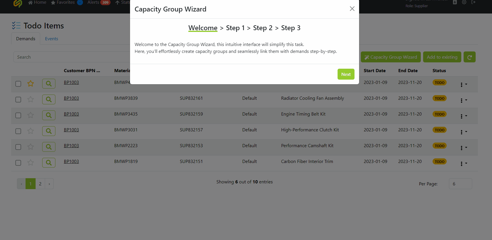
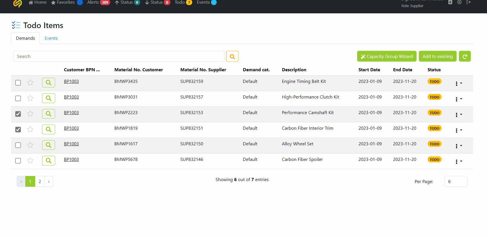

Table of contents:

# User Flow

## Customer

- **Create Demand:** 
    1. Access the application dashboard.

    2. Navigate to the "Demand Management" section.

    3. Click on the "Create New Demand" button.
    4. Fill in the required details such as unit of measure, supplier, category, start and end date, etc.

    6. Submit the demand for processing.
- **Update Values:** 
    1. Access the application dashboard.
    
    2. Go to the "Demand Management" section.
    
    3. Locate the previously created demand.
    4. Click on the demand to view its details.
        
    5. Make necessary updates to the demand values on its various categories, by clicking on Edit.
    6. Verify the accuracy of the updated values.
    7. Save the changes.

## Supplier

- **Manage Capacity Groups:** 
    1. Access the application dashboard.
    
    2. On the top menu select the **Todo** section, it will show you the count of the demands waiting a supplier interaction .
    3. View pending demands, the supplier can then select them and assign them to a capacity group or create a new one if necessary.
    
        **3a.** If the supplier decides to create a new capacity group, he will need to click on Capacity Group Wizard he will then be presented with a step by step process to create a new capacity group.
        
        **3b.** To add to an existing capacity group, simply click on **Add to existing** and follow the prompt.
        
    4. Now, accessing the newly created capacity group on the dashboard by clicking on the Eye icon.
    5. We can monitor and assign capacity in production lines to the capacity group, in its various categories.

        **5a.** They can visualize the associated material demands on the **Materials** tab.
        

        **5b.** The events registered on the Capacity group by acessing the **Events** tab.
        

        **5c.** The contacts of the associated companies on the **Contacts** tab.
        

- **Allocate Resources:** 
    1. Access the application dashboard.
    2. Go to the "Capacity Management" section.
    3. Select a specific capacity group to manage.
    4. Allocate resources based on demand forecasts and production requirements.
    5. Adjust resource allocations as needed to optimize production efficiency.

## Admin

- **Manage User Roles and Permissions:** 
    1. Access the application admin panel.
    2. Navigate to the "User Management" section.
    3. View existing user roles and permissions.
    4. C
