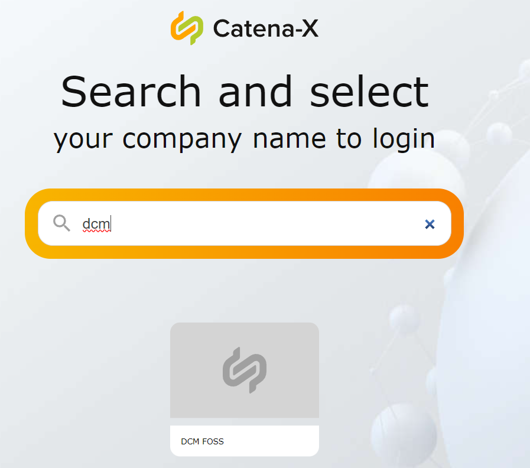
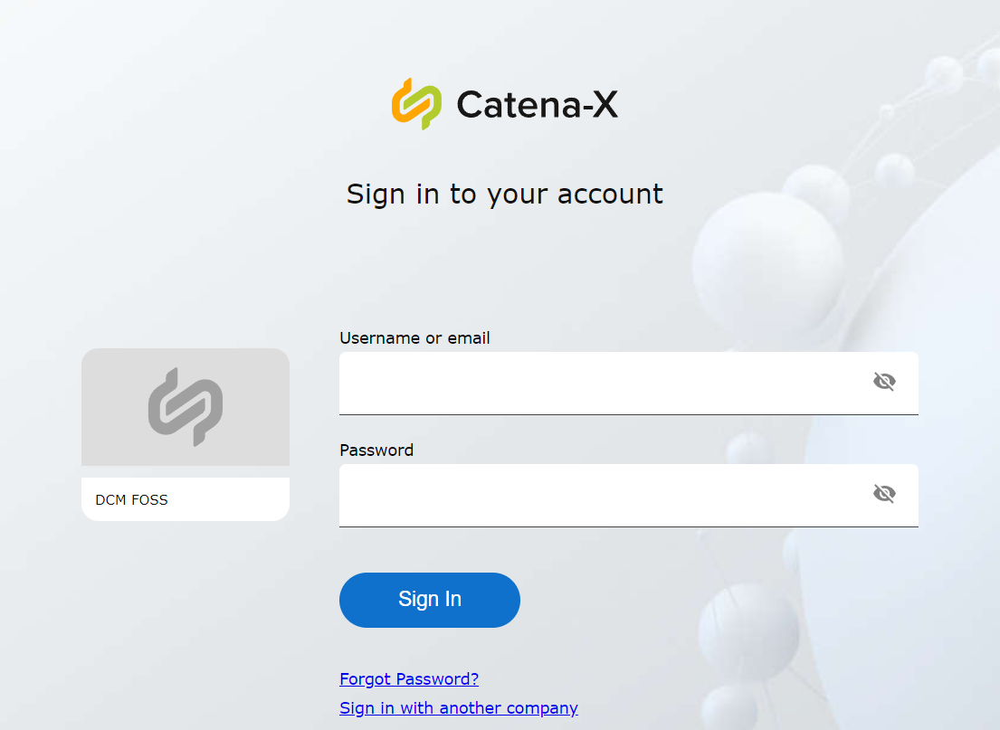
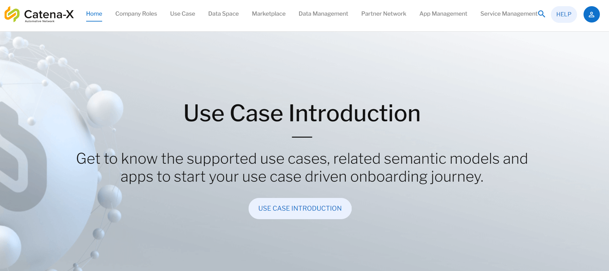
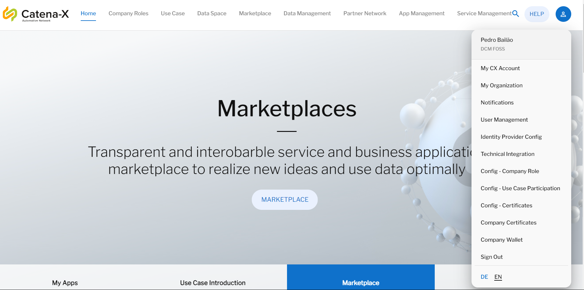
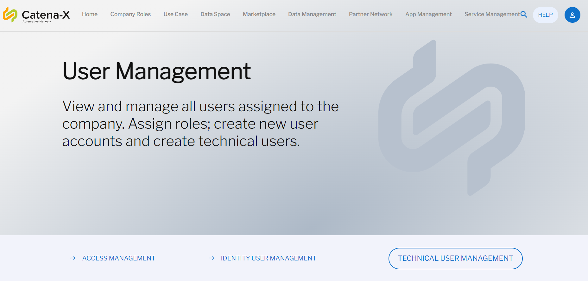
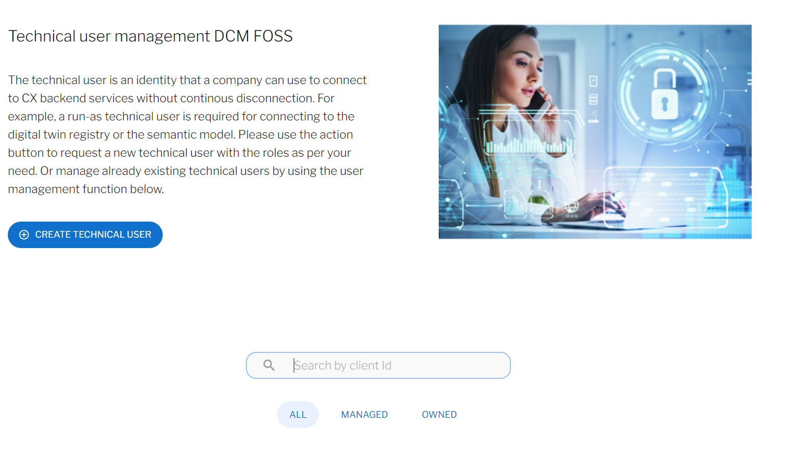
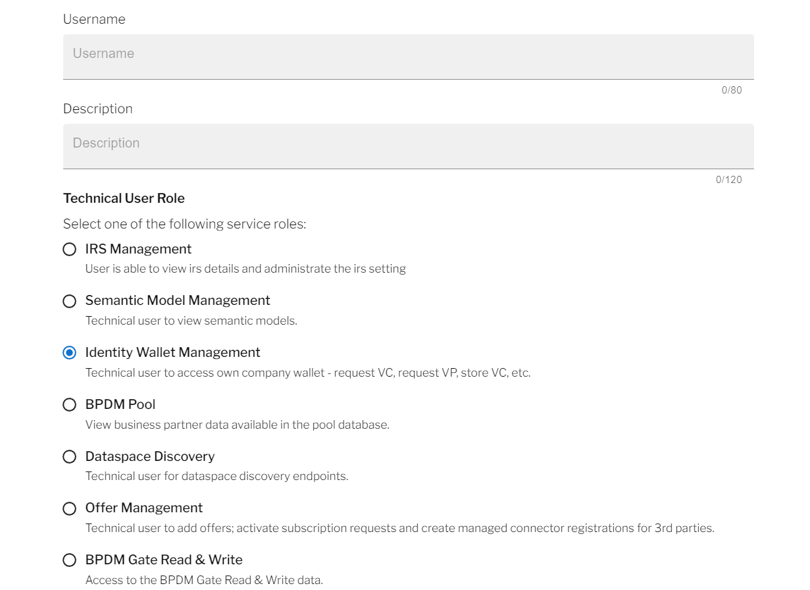
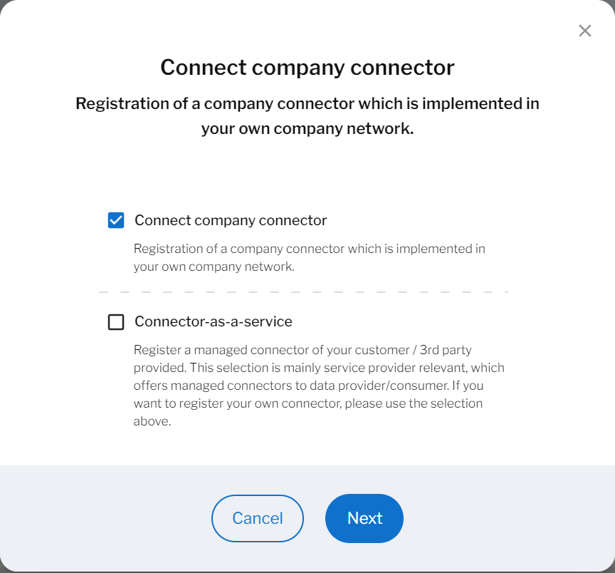
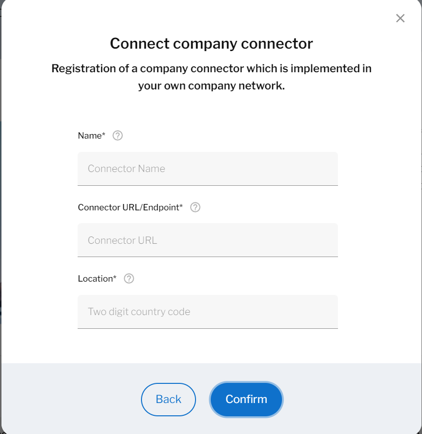

Table of Contents
  - [Table of Contents](#table-of-contents)
  - [Starting Point](#starting-point)
  - [Find Your Company](#find-your-company)
  - [Create Technical User](#create-technical-user)
  - [Register Connector](#register-connector)
    
  - [NOTICE](#notice)

## Eclipse Tractus-X Portal User Guide
https://github.com/eclipse-tractusx/portal-assets/blob/v1.8.0/docs/user

## DCM FOSS specific quickstart guide

  
Click me to expand

## Starting Point

Before anything else, your company needs to registered on the Catena Portal, for that you can create an issues here: https://github.com/eclipse-tractusx/portal-frontend-registration

## Find Your Company

When you go to the Portal website that is relevant to you, you will find a screen similar to this:

Then you can search for your company, using the search bar, in this case we will search for the company DCM, and this is what we are going to see:

Now, if you click on your company, you will be redirected to the login page, where you can submit your credentials, given when you registered on the portal.

After the login, you will go to the Portal main page.

## Create Technical User

To create a new Technical User for the EDC, click on the blue icon, on the right top side of your screen, and then select `User Management`.

You will then be redirected to the following page:

Click on `Technical User Management` and you will go to the following page:

Select `Create Technical User`, and this window will appear:

Fill the forms with a `Name`, a `Description` and select `Identity Wallet Management`. 
Finally scroll down and select `confirm`.

And your user is now created.

## Register Connector

To register a new connector for the EDC, click on the blue icon, on the right top side of your screen, and then select `Technical Integration`.

You will be redirected to his page:

On this page you can see every connector that you have previous registered and register a new one.
If we click on `Register Connector` the following window will open.

You will select `Connect company connector` and then `Next`.

After that, a new form will appear:

Fill the forms with a `Connector Name`, a `Connector URL/EndPoint` (Must be https) and a `Two Digit country code` (Must be in capital letters).
Finally select `confirm`.

And your connector is now registered.

## NOTICE

This work is licensed under the [Apache-2.0](https://www.apache.org/licenses/LICENSE-2.0).

- SPDX-License-Identifier: Apache-2.0
- SPDX-FileCopyrightText: 2022,2024 Bayerische Motoren Werke Aktiengesellschaft (BMW AG)
- SPDX-FileCopyrightText: 2022,2024 Contributors to the Eclipse Foundation
- Source URL: https://github.com/eclipse-tractusx/demand-capacity-mgmt/
